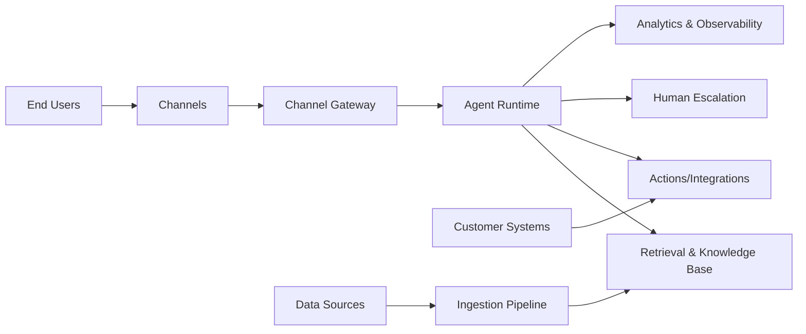

# Design: Norway-First AI Support Agent Platform

## Overview
Design a Norway-first AI support agent platform that competes with Chatbase, optimized for fast setup, broad integrations, and EU-grade compliance. The system enables companies to ingest knowledge from many sources, deploy agents across channels, integrate with customer systems, and monitor outcomes. Primary success metric for v1: time-to-first-agent and time-to-first-resolution for a new customer.

## Detailed Requirements
- Target customers: Norway-based companies across SMBs and enterprises with customer service needs.
- Primary outcome: fastest possible setup of support agents for new customers.
- Data sources: broad coverage matching or exceeding Chatbase (files, website crawl, Q&A, text snippets, Notion, ticketing, etc.).
- Multi-channel deployment: web widget + help page plus messaging and support channels.
- Actions/integrations: allow agents to perform tasks and escalate to humans.
- Security and compliance: GDPR-aligned controls; enterprise-ready security posture.

## Architecture Overview
The system centers on an Agent Runtime with Retrieval and Actions. Ingestion pipelines feed a Knowledge Base and are periodically retrained. Channels route user messages to the runtime, which optionally triggers actions and escalations. Analytics and logging capture usage and quality signals.

## Components and Interfaces

### 1) Ingestion Pipeline
- Connectors: website crawler, file uploads, Q&A builder, Notion, ticketing (Zendesk/Salesforce), future connectors (Drive, Dropbox).
- Processing: parsing, chunking, metadata enrichment, deduplication.
- Retrain scheduler: auto-retrain policies (daily) and manual retrain triggers.

Interfaces:
- Connector API: `POST /sources` (create), `POST /sources/:id/retrain`, `DELETE /sources/:id`.
- Crawler config: include/exclude paths, sitemap input, URL list.

### 2) Knowledge Base + Retrieval
- Storage for embeddings + raw chunks.
- Hybrid retrieval (BM25 + vector) with reranking.
- Per-tenant isolation.

Interfaces:
- Retrieval service: `POST /retrieve` with query, context constraints, max sources.

### 3) Agent Runtime
- Orchestrates LLM, retrieval, and actions.
- System prompt templates, response style, escalation rules.
- Per-channel overrides for prompts and UI text.

Interfaces:
- Chat API: `POST /chat` (streaming optional).
- Conversation API: `GET /conversations`.

### 4) Actions + Integrations
- Prebuilt actions: Slack notify, lead capture, schedule (Cal/Calendly), billing (Stripe), CRM ticket creation.
- Custom action: call customer-defined API endpoints.
- Action sandbox with strict auth + payload validation.

Interfaces:
- `POST /actions` (create), `POST /actions/:id/execute`.

### 5) Deployment Channels
- Web widget (JS embed + domain allowlist).
- Help page (hosted or custom domain proxy).
- Email, WhatsApp, Messenger, Instagram, Slack.
- CRM/ticketing channels (Zendesk, Salesforce), ecommerce (Shopify).

Interfaces:
- Channel config: `POST /channels` and `PATCH /channels/:id`.

### 6) Admin Console
- Agent creation wizard optimized for 10-minute setup.
- Source management, retrain status, analytics, feedback.
- Team roles and access controls.

### 7) Analytics & Observability
- KPIs: deflection rate, resolution rate, CSAT, time-to-resolution, setup time.
- Conversation review, feedback, and query gaps.

## Data Models

### Tenant
- id, name, plan, region, data_residency, created_at

### Agent
- id, tenant_id, name, base_prompt, model, status, created_at

### Source
- id, agent_id, type, config, status, last_synced_at

### Chunk
- id, source_id, content, metadata, embedding

### Action
- id, agent_id, type, config, enabled

### Channel
- id, agent_id, type, config, enabled

### Conversation
- id, agent_id, channel_id, user_id, started_at, ended_at

### Message
- id, conversation_id, role, content, metadata, created_at

### Feedback
- id, message_id, rating, comment

## Error Handling
- Ingestion failures: per-source error states with retry and backoff; surfaced in dashboard.
- Action failures: fallback response + log + optional escalation.
- Retrieval empty: prompt to ask clarifying questions or escalate.
- Channel delivery errors: dead-letter queue + retry and alerting.
- Compliance errors (PII policy violations): block response and notify admin.

## Acceptance Criteria (Given-When-Then)
- Given a new tenant, when they create an agent and add a website URL, then the system ingests and retrains successfully within a defined SLA.
- Given an agent with multiple sources, when a user asks a relevant question, then the response cites or references the correct source chunk.
- Given an agent with an escalation rule, when confidence is low, then a ticket is created in the configured CRM.
- Given a web widget on an allowed domain, when a user opens it, then it loads and can stream responses.
- Given a Notion source, when content changes, then auto-retrain updates the KB within 24 hours.
- Given an action integration (e.g., Stripe), when a user asks about billing, then the action executes and returns structured results.
- Given GDPR mode enabled, when a user requests deletion, then the system deletes stored conversation data.

## Testing Strategy
- Unit tests: ingestion parsers, retrieval, action validation.
- Integration tests: connector OAuth flows, channel webhooks, CRM ticket creation.
- E2E tests: “create agent → ingest sources → deploy widget → answer question.”
- Load tests: chat API concurrency, action execution latency.
- Security tests: data isolation, domain allowlist, rate limiting.
- Visual tests: developer/agent runs Playwright-based UI checks to validate core flows and widget rendering.

## Appendices

### Technology Choices (Proposed)
- LLMs: vendor-agnostic with model selection UI.
- Vector DB: managed vector store with EU region.
- Job runner: queue-based ingestion and retrain pipelines.
- Observability: OpenTelemetry + metrics dashboards.
- UI components: use shadcn/ui MCP and 8starlabs UI component libraries for consistent, fast UI development.

### Research Findings (Summary)
- Chatbase: multi-source ingestion (files, crawl, Q&A, Notion, tickets), auto-retrain, actions, multi-channel deployment, and developer API.
- Integrations: Slack, WhatsApp, Zendesk, Salesforce, Shopify, CMS builders, automation platforms, and more.
- Security: SOC 2 Type II + GDPR claims with encryption, roles, rate limiting, and domain allowlist.

### Alternative Approaches
- Focused MVP with fewer integrations (faster build but less competitive on “fast setup”).
- Norway-only channels first (strong local fit but lower global parity).
- Partner-first integration model (lighter maintenance but weaker UX control).
