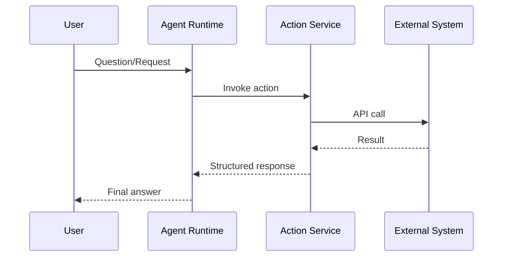

# Chatbase Actions & Integrations (Research)

## Scope
Agent actions and integration capabilities that enable real workflows.

## Key Findings
- Actions include: custom actions, lead collection, escalation to human, web search, Slack, Stripe, Calendly/Cal.com, Salesforce/Shopify actions.
- Actions allow the agent to trigger system workflows and external APIs.
- Escalation supports CRMs (Zendesk, Salesforce, Intercom, Freshdesk, ZohoDesk).

## Actions Inventory
- Custom action (custom code/API calls)
- Collect leads (forms)
- Escalate to human (ticket creation)
- Web search
- Slack notifications
- Stripe billing actions
- Calendly/Cal.com scheduling
- Salesforce and Shopify actions

## Architecture Sketch (Action Execution)

## Implications for Norway Competitor
- Strong action framework is crucial for “support agent” positioning.
- Prebuilt integrations reduce time-to-value (key differentiator for fast setup).

## Sources
- https://chatbase.co/docs/user-guides/chatbot/actions/actions-overview.md
