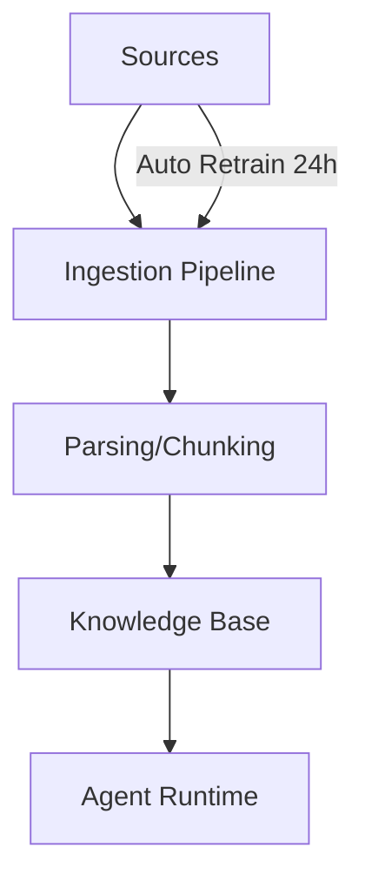

# Chatbase Data Sources & Training (Research)

## Scope
Training sources, retraining, and data ingestion options.

## Key Findings
- Data sources include file uploads, text snippets, website crawling, custom Q&A, Notion integration, and ticket imports via Salesforce/Zendesk.
- Auto Retrain available on higher plans; pulls updates every 24 hours.
- Website crawling supports sitemap or URL lists with include/exclude path filters.

## Data Sources Inventory
- Files: PDF, TXT, DOC/DOCX
- Text snippets: rich text, headings/lists/links
- Website crawling: full site, sitemap, or specific URLs
- Custom Q&A: multiple question variants per answer
- Notion integration
- Tickets: Salesforce or Zendesk via OAuth

## Architecture Sketch (Data Ingestion)

## Implications for Norway Competitor
- Broad sources are a core expectation; prioritizing “fast setup” requires a large integration surface.
- Ticket ingestion is a differentiator for customer service use cases.
- Auto retrain and crawl filters reduce maintenance overhead.

## Sources
- https://chatbase.co/docs/user-guides/chatbot/data-sources.md
