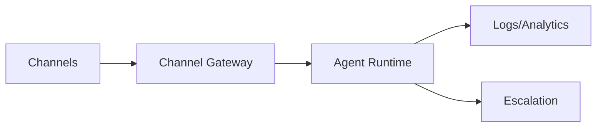

# Chatbase Deployment Channels (Research)

## Scope
Channels, widget deployment, help page, and third-party integrations.

## Key Findings
- Multi-channel deployment is a core product claim.
- Web widget and help page are first-class.
- Email, Slack, WhatsApp, Messenger, Instagram, Zendesk, Salesforce, Shopify, Zapier, WordPress supported.

## Channels Inventory
- Web: chat widget, help page
- Messaging/social: WhatsApp, Messenger, Instagram
- Productivity: Slack
- Support/CRM: Zendesk, Salesforce
- E-commerce: Shopify
- Automation: Zapier
- CMS: WordPress
- Email (beta)

## Architecture Sketch (Channel Routing)

## Implications for Norway Competitor
- “Fast setup” demands quick channel activation and simple widgets.
- Local compliance + language support should extend across channels.
- Email and WhatsApp are critical for Nordic SMBs.

## Sources
- https://chatbase.co/docs/user-guides/chatbot/deploy.md
