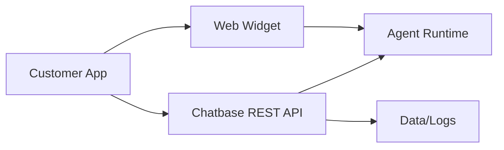

# Chatbase Developer & API Surface (Research)

## Scope
Developer APIs, management endpoints, and customization capabilities.

## Key Findings
- REST API supports: chat, agent management, conversations, contacts, leads.
- Streaming chat responses supported.
- Widget customization supports custom domains, control, identity verification, custom messages.
- Webhooks and event listeners for real-time events.

## API/Dev Inventory
- Chat API (streaming)
- Chatbot management APIs
- Conversations API
- Contacts API
- Leads API
- Event listeners
- Webhooks
- JS embed script and widget control
- Identity verification
- Custom domains

## Architecture Sketch (Dev Integration)

## Implications for Norway Competitor
- A clean API + widget SDK will be expected by dev teams.
- Identity verification is important for regulated/enterprise customers.

## Sources
- https://chatbase.co/docs/developer-guides/api-integration.md
- https://chatbase.co/docs/llms.txt
