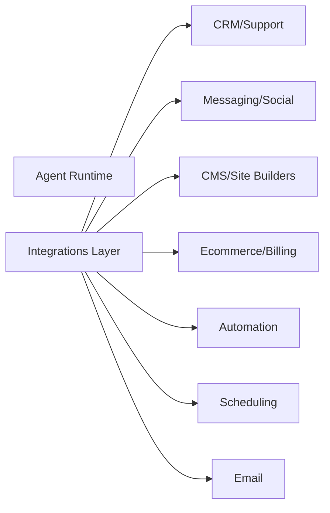

# Chatbase Integrations Inventory (Research)

## Scope
Integration coverage for customer systems and operational workflows.

## Key Findings
- Integrations span support/CRM, ecommerce, messaging, marketing, CMS, and automation.
- Docs list native integrations plus deployment channel integrations.
- Actions also connect to external systems (Stripe, Calendly, Salesforce, Shopify).

## Integration Categories (from docs index)
### Support/CRM
- Zendesk
- Salesforce
- Sunshine
- HubSpot

### Messaging/Social
- Slack
- WhatsApp
- Messenger
- Instagram

### Ecommerce
- Shopify
- Stripe (billing)

### CMS/Site Builders
- WordPress
- Wix
- Webflow
- Weebly
- Framer
- Bubble

### Automation/Workflows
- Zapier
- ViaSocket

### Platform/Hosting
- Vercel (marketplace install)

### Scheduling
- Calendly
- Cal.com

### Email
- Email integration (support inbox automation)

## Architecture Sketch (Integration Surface)

## Implications for Norway Competitor
- Broad integration catalog reduces onboarding friction for “fast setup.”
- Prioritize Nordic-relevant stacks (Zendesk, HubSpot, Shopify, WhatsApp, Slack, email).
- Automation and CMS integrations reduce engineering effort for SMBs.

## Sources
- https://chatbase.co/docs/llms.txt
- https://www.chatbase.co/
