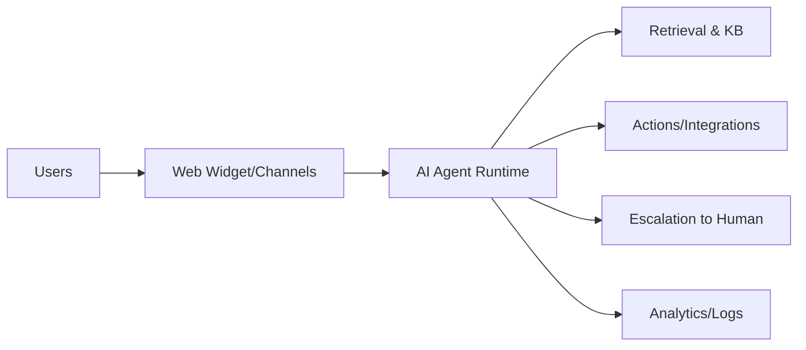

# Chatbase Product Overview (Research)

## Scope
Product surface, positioning, and high-level capabilities relevant for a Norway-first competitor.

## Key Findings
- Positioning: “AI agents for customer service” with emphasis on simplicity, security, and LLM-native workflows.
- Core flow: build agent, deploy, solve issues, refine/optimize, escalate to human, review analytics.
- Emphasis on integrations, actions, and analytics to move beyond FAQ bots.

## Feature Surface (High Level)
- Agent creation and management in a dashboard
- Knowledge training from multiple sources
- Actions to connect to external systems and perform tasks
- Deployment across web, messaging, and productivity channels
- Analytics, activity logs, and contacts/leads
- Security and compliance messaging (SOC 2 Type II, GDPR)

## Architecture Sketch (Conceptual)

## Implications for Norway Competitor
- Must match multi-channel deployment and quick onboarding to win on “fast setup.”
- Clear security/GDPR story is table stakes; Norway/EU data handling needs strong emphasis.
- Actions and integrations are critical for “real work” (tickets, billing, scheduling).

## Sources
- https://www.chatbase.co/
- https://www.chatbase.co/security
