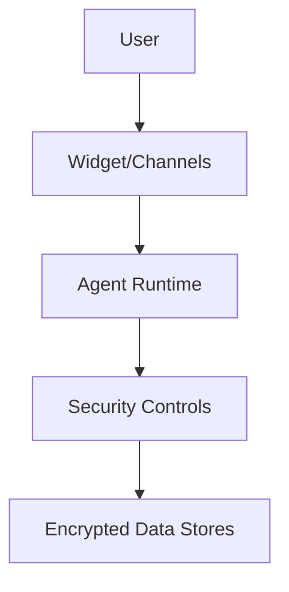

# Chatbase Security & Compliance (Research)

## Scope
Security posture and compliance claims.

## Key Findings
- Claims SOC 2 Type II and GDPR compliance.
- Encryption at rest and in transit.
- Controls: rate limiting, domain allowlist, user roles.

## Architecture Sketch (Security Controls)

## Implications for Norway Competitor
- Must provide GDPR alignment and security controls as baseline.
- Norway/EU data residency and DPA expectations likely a differentiator.

## Sources
- https://www.chatbase.co/security
